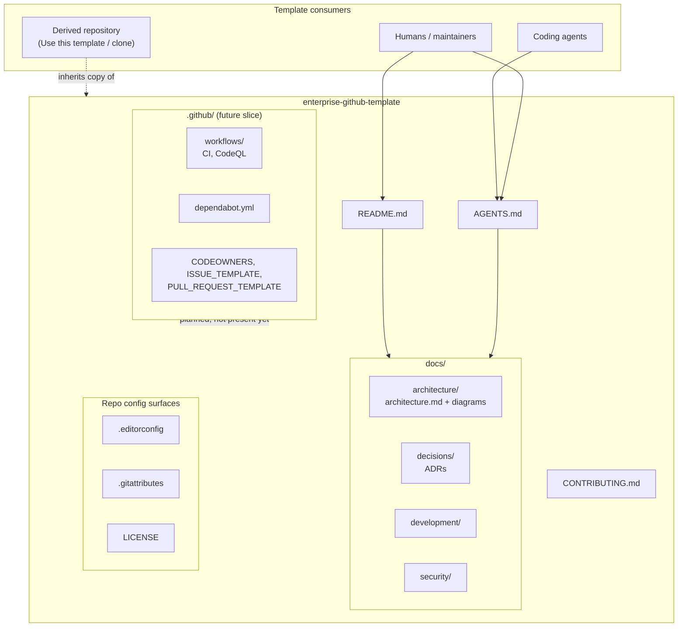

# Architecture diagram

Mermaid diagram-as-code for the **current** template. Boxes are files and process surfaces that exist (or are planned and labeled as such), not a fictional application.

## How to read it

- **Consumers** (people and agents) enter through `README.md` and `AGENTS.md`.
- **`docs/`** holds the lasting description of architecture, decisions, development practice, and security posture.
- **`.github/`** is drawn as a future surface so the diagram does not pretend CI already exists. When that slice lands, update this figure and [architecture.md](architecture.md) in the same PR.
- A **derived repository** gets a snapshot of these files; it does not stay coupled to upstream template updates unless the consumer chooses to merge them later.
