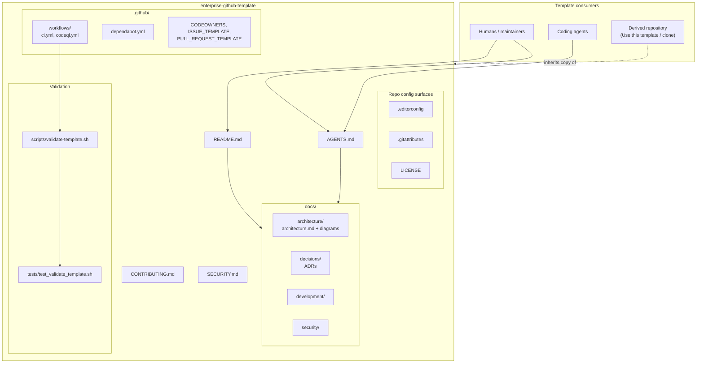

# Architecture diagram

Mermaid diagram-as-code for the **current** template. Boxes are files and process surfaces that exist in the tree, not a fictional application.

## How to read it

- **Consumers** (people and agents) enter through `README.md` and `AGENTS.md`.
- **`docs/`** holds the lasting description of architecture, decisions, development practice, and security posture.
- **`.github/`** runs template validation and CodeQL on Actions YAML, plus Dependabot and community templates.
- **`scripts/` / `tests/`** are the only “runtime” in this repo: shell checks invoked by CI and locally.
- A **derived repository** gets a snapshot of these files; it does not stay coupled to upstream template updates unless the consumer chooses to merge them later.
