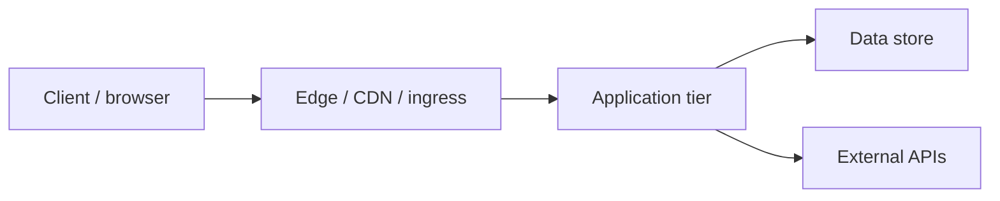

# Network diagram

## Template reality

This repository is a **documentation and process template**. It has **no networked runtime**: no servers, APIs, databases, queues, or cloud accounts are defined or deployed from this tree.

Therefore this template does **not** ship a production network diagram. Adding one here would invent infrastructure that does not exist and would violate the “docs match reality” rule in `AGENTS.md`.

## Consumer requirement

When a derived repository introduces networked or cloud systems (for example HTTPS APIs, private VPCs, managed databases, CDNs, or third-party SaaS callouts), the consumer **MUST**:

1. Replace or extend this file with a real network diagram for *their* system.
2. Keep the diagram next to `architecture.md` and link it from the architecture index.
3. Update the diagram in the same PR that introduces or changes those network boundaries.

Until then, leave this note in place or delete it only after a real diagram exists.

## Consumer-owned stub (example only)

The Mermaid below is a **placeholder shape** for consumers. It is not part of this template’s runtime. Copy it into your product repo and rename boxes to match what you actually deploy.

Mark your real diagram as owned by the product team, keep secrets out of labels, and prefer environment-agnostic names over vendor marketing terms unless the vendor is a hard dependency recorded in an ADR.
